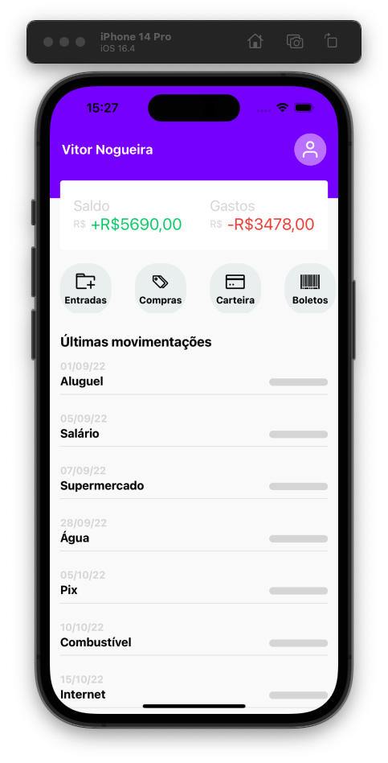

### Finance App 🏦



O Finance App é um aplicativo de controle de finanças desenvolvido com React Native usando Expo Go e Xcode para simulação no dispositivo celular. O aplicativo permite visualizar uma lista de entradas e saídas, ocultar e exibir os valores das despesas e possui um header com alguns botões.

### Instalação ⚙️
Para instalar e configurar o Finance App, siga os seguintes passos:

Clone o repositório em seu computador:

```
git clone git@github.com:vitor-nogueira-dev/finance-app.git
```
Acesse a pasta do projeto:
```
cd finance-app
```
Instale as dependências do projeto:
```
npm install
```
Inicie o projeto:

Abra o aplicativo Expo Go em seu celular (caso não tenha algum simulador) e escaneie o QR code exibido no terminal para iniciar o aplicativo.

Se possuir o Android Studio execute:
```
npm run android
```

Se possuir o X-code execute:
```
npm run ios
```
Se possuir o Expo Go no celular execute:
```
npm start
```

----
### Uso 📱
Para usar o Finance App, siga os seguintes passos:

Abra o aplicativo no seu celular.

Na tela inicial, você verá uma lista de entradas e saídas.

- Clique em cada despesa para ocultar ou exibir o valor correspondente.


### Funcionalidades
O Finance App possui as seguintes funcionalidades:

1. Listar entradas e saídas.
2. Ocultar e exibir valores das despesas.
3. Header com botões de navegação.

---
### Contribuição 💻
O Finance App está aberto a contribuições. Para contribuir, siga os seguintes passos:

Faça um fork do repositório em seu GitHub.
Crie um branch com a sua feature:
```
git checkout -b minha-feature
```
Faça as alterações necessárias e adicione os arquivos modificados:
```
git add .
```
Faça o commit das suas alterações:
```
git commit -m "Minha mensagem de commit"
```
Faça o push das suas alterações para o seu fork:
```
git push origin minha-feature
```
Crie um pull request para o repositório original.

Contato
Em caso de dúvidas ou problemas, entre em contato através do e-mail vleonel96@gmail.com